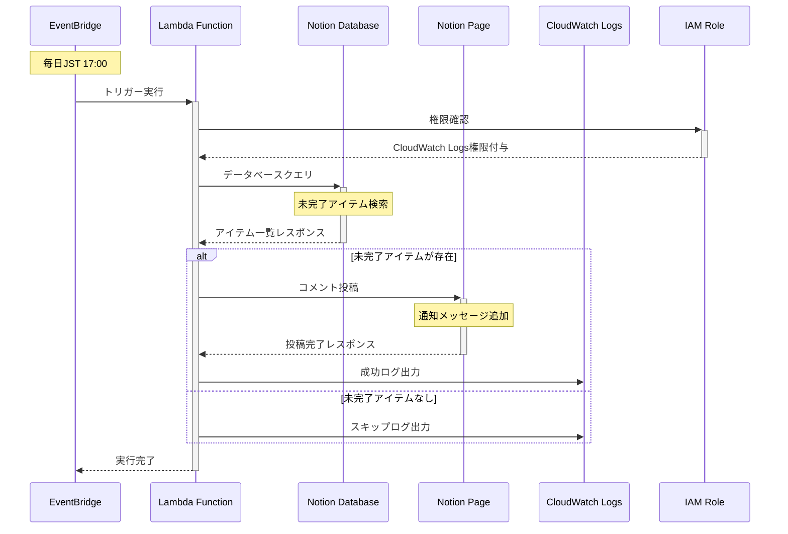

# Shopping Reminder Module

このモジュールは、Notion APIを使用してショッピングリストを監視し、未完了のアイテムがある場合に通知を送るAWS Lambdaアプリケーションを管理します。

## 機能

- **自動スケジュール実行**: EventBridgeで毎日17:00（JST）に実行
- **Notion API統合**: データベースクエリとページコメント機能
- **セキュリティ考慮**: 最小権限IAMロールとsensitive変数保護
- **リソース管理**: AWS Resource Groupsによる一元管理
- **ログ記録**: CloudWatch Logsで実行ログを保存

## 使用方法

```hcl
module "shopping_reminder" {
  source = "./modules/shopping-reminder"

  # 必須変数
  notion_api_key      = var.notion_api_key
  notion_database_id  = var.notion_database_id
  notion_page_id      = var.notion_page_id
  lambda_zip_path     = var.lambda_zip_path
  lambda_source_code_hash = var.lambda_source_code_hash

  # オプション変数
  lambda_function_name = "shopping-reminder"
  schedule_expression  = "cron(0 8 * * ? *)"  # JST 17:00 = UTC 08:00
  lambda_timeout       = 30
  lambda_memory_size   = 128

  tags = {
    Environment = "production"
    ManagedBy   = "terraform"
    Project     = "shopping-reminder"
  }
}
```

## アーキテクチャ



<!-- BEGIN_TF_DOCS -->


## Requirements

| Name | Version |
|------|---------|
| <a name="requirement_terraform"></a> [terraform](#requirement\_terraform) | >= 1.2.0 |
| <a name="requirement_aws"></a> [aws](#requirement\_aws) | ~> 5.92 |

## Providers

| Name | Version |
|------|---------|
| <a name="provider_aws"></a> [aws](#provider\_aws) | ~> 5.92 |

## Modules

No modules.

## Resources

| Name | Type |
|------|------|
| [aws_cloudwatch_event_rule.daily_reminder](https://registry.terraform.io/providers/hashicorp/aws/latest/docs/resources/cloudwatch_event_rule) | resource |
| [aws_cloudwatch_event_target.lambda_target](https://registry.terraform.io/providers/hashicorp/aws/latest/docs/resources/cloudwatch_event_target) | resource |
| [aws_cloudwatch_log_group.lambda_log_group](https://registry.terraform.io/providers/hashicorp/aws/latest/docs/resources/cloudwatch_log_group) | resource |
| [aws_iam_role.lambda_role](https://registry.terraform.io/providers/hashicorp/aws/latest/docs/resources/iam_role) | resource |
| [aws_iam_role_policy.lambda_policy](https://registry.terraform.io/providers/hashicorp/aws/latest/docs/resources/iam_role_policy) | resource |
| [aws_iam_role_policy_attachment.lambda_basic_execution](https://registry.terraform.io/providers/hashicorp/aws/latest/docs/resources/iam_role_policy_attachment) | resource |
| [aws_lambda_function.shopping_reminder](https://registry.terraform.io/providers/hashicorp/aws/latest/docs/resources/lambda_function) | resource |
| [aws_lambda_permission.allow_eventbridge](https://registry.terraform.io/providers/hashicorp/aws/latest/docs/resources/lambda_permission) | resource |
| [aws_resourcegroups_group.shopping_reminder](https://registry.terraform.io/providers/hashicorp/aws/latest/docs/resources/resourcegroups_group) | resource |
| [aws_resourcegroups_group.shopping_reminder_all](https://registry.terraform.io/providers/hashicorp/aws/latest/docs/resources/resourcegroups_group) | resource |
| [aws_caller_identity.current](https://registry.terraform.io/providers/hashicorp/aws/latest/docs/data-sources/caller_identity) | data source |
| [aws_region.current](https://registry.terraform.io/providers/hashicorp/aws/latest/docs/data-sources/region) | data source |

## Inputs

| Name | Description | Type | Default | Required |
|------|-------------|------|---------|:--------:|
| <a name="input_cloudwatch_log_retention_days"></a> [cloudwatch\_log\_retention\_days](#input\_cloudwatch\_log\_retention\_days) | CloudWatch log retention period in days | `number` | `14` | no |
| <a name="input_create_comprehensive_resource_group"></a> [create\_comprehensive\_resource\_group](#input\_create\_comprehensive\_resource\_group) | Whether to create a comprehensive resource group that includes all AWS resources | `bool` | `false` | no |
| <a name="input_lambda_function_name"></a> [lambda\_function\_name](#input\_lambda\_function\_name) | Name of the Lambda function | `string` | `"shopping-reminder"` | no |
| <a name="input_lambda_memory_size"></a> [lambda\_memory\_size](#input\_lambda\_memory\_size) | Lambda function memory size in MB | `number` | `128` | no |
| <a name="input_lambda_source_code_hash"></a> [lambda\_source\_code\_hash](#input\_lambda\_source\_code\_hash) | Base64 encoded hash of the Lambda zip file | `string` | n/a | yes |
| <a name="input_lambda_timeout"></a> [lambda\_timeout](#input\_lambda\_timeout) | Lambda function timeout in seconds | `number` | `30` | no |
| <a name="input_lambda_zip_path"></a> [lambda\_zip\_path](#input\_lambda\_zip\_path) | Path to the Lambda deployment zip file | `string` | n/a | yes |
| <a name="input_notion_api_key"></a> [notion\_api\_key](#input\_notion\_api\_key) | Notion API key for accessing the workspace | `string` | n/a | yes |
| <a name="input_notion_database_id"></a> [notion\_database\_id](#input\_notion\_database\_id) | ID of the Notion database containing shopping list items | `string` | n/a | yes |
| <a name="input_notion_page_id"></a> [notion\_page\_id](#input\_notion\_page\_id) | ID of the Notion page where comments will be posted | `string` | n/a | yes |
| <a name="input_resource_group_name"></a> [resource\_group\_name](#input\_resource\_group\_name) | Name of the AWS Resource Group | `string` | `"shopping-reminder-resources"` | no |
| <a name="input_schedule_expression"></a> [schedule\_expression](#input\_schedule\_expression) | EventBridge schedule expression for the reminder (JST 17:00 = UTC 08:00) | `string` | `"cron(0 8 * * ? *)"` | no |
| <a name="input_tags"></a> [tags](#input\_tags) | Tags to apply to all resources | `map(string)` | <pre>{<br/>  "ManagedBy": "terraform",<br/>  "Project": "shopping-reminder"<br/>}</pre> | no |

## Outputs

| Name | Description |
|------|-------------|
| <a name="output_cloudwatch_log_group_name"></a> [cloudwatch\_log\_group\_name](#output\_cloudwatch\_log\_group\_name) | Name of the CloudWatch log group |
| <a name="output_comprehensive_resource_group_arn"></a> [comprehensive\_resource\_group\_arn](#output\_comprehensive\_resource\_group\_arn) | ARN of the comprehensive resource group (if created) |
| <a name="output_comprehensive_resource_group_name"></a> [comprehensive\_resource\_group\_name](#output\_comprehensive\_resource\_group\_name) | Name of the comprehensive resource group (if created) |
| <a name="output_eventbridge_rule_arn"></a> [eventbridge\_rule\_arn](#output\_eventbridge\_rule\_arn) | ARN of the EventBridge rule |
| <a name="output_eventbridge_rule_name"></a> [eventbridge\_rule\_name](#output\_eventbridge\_rule\_name) | Name of the EventBridge rule |
| <a name="output_iam_role_arn"></a> [iam\_role\_arn](#output\_iam\_role\_arn) | ARN of the IAM role used by Lambda |
| <a name="output_lambda_function_arn"></a> [lambda\_function\_arn](#output\_lambda\_function\_arn) | ARN of the Lambda function |
| <a name="output_lambda_function_name"></a> [lambda\_function\_name](#output\_lambda\_function\_name) | Name of the Lambda function |
| <a name="output_resource_group_arn"></a> [resource\_group\_arn](#output\_resource\_group\_arn) | ARN of the main resource group |
| <a name="output_resource_group_name"></a> [resource\_group\_name](#output\_resource\_group\_name) | Name of the main resource group |
| <a name="output_schedule_expression"></a> [schedule\_expression](#output\_schedule\_expression) | EventBridge schedule expression used |

<!-- END_TF_DOCS -->

## セキュリティ

- **IAMロール**: 最小権限の原則に従い、CloudWatch Logsの作成・書き込み権限のみ
- **Sensitive変数**: `notion_api_key`は`sensitive = true`でマーク
- **VPC**: 不要なVPC設定は省略し、シンプルな構成を維持

## 監視とトラブルシューティング

### CloudWatchログの確認

```bash
# リアルタイムログ監視
aws logs tail /aws/lambda/shopping-reminder --follow

# 特定時間範囲のログ確認
aws logs filter-log-events --log-group-name /aws/lambda/shopping-reminder \
  --start-time 1640995200000 --end-time 1640998800000
```

### Lambda関数のテスト実行

```bash
# 手動実行テスト
aws lambda invoke --function-name shopping-reminder response.json

# レスポンス確認
cat response.json
```

### リソースグループでの一元管理

```bash
# プロジェクトリソース一覧
aws resource-groups list-group-resources --group-name shopping-reminder-resources
```

## 開発とテスト

モジュールの開発・テスト時は、以下の環境変数を設定してください：

```bash
export NOTION_API_KEY_TEST="secret_test_key"
export NOTION_DATABASE_ID_TEST="test-database-id"
export NOTION_PAGE_ID_TEST="test-page-id"
```
